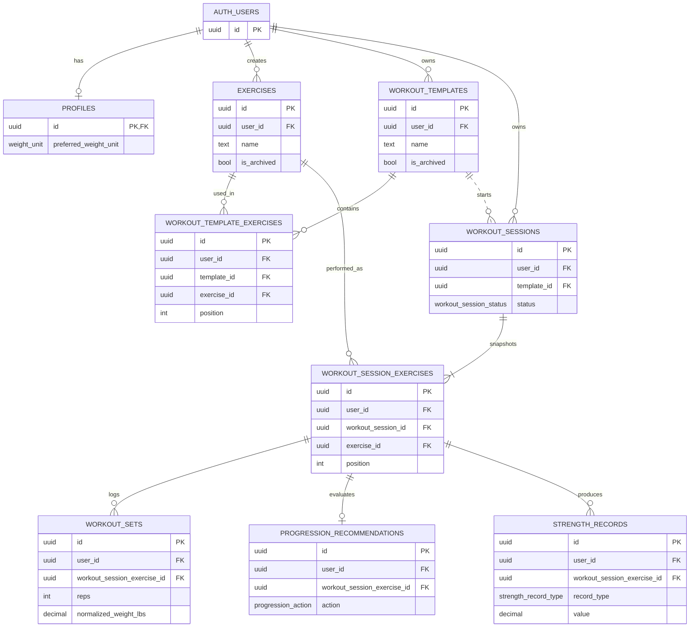

# RepPilot Schema Plan

This document is the Phase 3 database contract for RepPilot. The MVP schema is strength-training first. 

## Design Principles

- Supabase stores durable facts, relationships, ownership, and audit context.
- Pure TypeScript domain modules decide progression, metrics, unit conversion, and record detection.
- Database rows do not need to match domain input types one-to-one.
- Feature mappers translate Supabase rows into domain inputs such as `PerformedSet[]` and `StrengthSet[]`.
- Store both the user-entered weight and `normalized_weight_lbs` anywhere weight comparisons matter.
- Keep record and recommendation source identity explicit through `workout_session_exercise_id`.
- Use `user_id` on user-owned tables to keep RLS policies simple and auditable.

## Core Relationship Model



## Tables

### `profiles`

App-owned profile row for a Supabase auth user.

Columns:

- `id`: primary key, references `auth.users(id)` with cascade delete.
- `preferred_weight_unit`: `weight_unit`, defaults to `lb`.
- `created_at`, `updated_at`.

Notes:

- Supabase Auth owns identity. `profiles` stores app preferences only.

### `exercises`

Strength exercise library. This table contains global system exercises and user-created custom exercises.

Columns:

- `id`: primary key.
- `user_id`: nullable owner, references `auth.users(id)`.
- `name`: exercise display name.
- `is_archived`: soft archive flag.
- `created_at`, `updated_at`.

Notes:

- `user_id = null` means a system exercise readable by authenticated users.
- `user_id = auth.uid()` means a custom exercise owned by the current user.
- Do not add `exercise_type` in the MVP. Future activity logging should use its own model instead of distorting the strength schema.

### `workout_templates`

Reusable workout plan header.

Columns:

- `id`: primary key.
- `user_id`: owner, references `auth.users(id)`.
- `name`: template name.
- `is_archived`: soft archive flag.
- `created_at`, `updated_at`.

Notes:

- A template is not the workout history source of truth. Actual workouts live in `workout_sessions`.
- Template names are unique per user.

### `workout_template_exercises`

Ordered exercise configuration inside a template.

Columns:

- `id`: primary key.
- `user_id`: owner, references `auth.users(id)`.
- `template_id`: references `workout_templates(id)`.
- `exercise_id`: references `exercises(id)`.
- `position`: order within the template.
- `target_sets`: target working set count.
- `min_reps`: bottom of target rep range.
- `max_reps`: top of target rep range.
- `default_weight_value`: user-facing planned weight value.
- `default_weight_unit`: `weight_unit`.
- `default_normalized_weight_lbs`: comparable planned weight in pounds.
- `weight_increment_lbs`: progression increment in pounds.
- `created_at`, `updated_at`.

Notes:

- This is a one-to-many relationship from `workout_templates` to `workout_template_exercises`.
- The same `template_id` appears in multiple rows, one row per planned exercise block.
- Position should be unique per template.
- An exercise should appear only once per template in the MVP.

### `workout_sessions`

One workout instance the user started.

Columns:

- `id`: primary key.
- `user_id`: owner, references `auth.users(id)`.
- `template_id`: nullable reference to `workout_templates(id)`.
- `status`: `workout_session_status`.
- `started_at`: timestamp.
- `completed_at`: nullable timestamp.
- `notes`: optional user notes.
- `created_at`, `updated_at`.

Notes:

- `template_id` is nullable so the schema can later support ad hoc workouts.
- The MVP UI should still focus on starting from templates.
- Do not add `template_name_snapshot` for now. Exercise-level snapshots matter more than template-name history.
- Keep `status` because gym workouts are long-running. Partial workouts should be persisted as `in_progress`, not only cached locally.

### `workout_session_exercises`

Snapshot of the exercise block inside a specific workout session.

Columns:

- `id`: primary key.
- `user_id`: owner, references `auth.users(id)`.
- `workout_session_id`: references `workout_sessions(id)`.
- `exercise_id`: references `exercises(id)`.
- `exercise_name_snapshot`: exercise name at workout start.
- `position`: order within the session.
- `target_sets`: target working set count at workout start.
- `min_reps`: bottom of target rep range at workout start.
- `max_reps`: top of target rep range at workout start.
- `planned_weight_value`: user-facing planned weight value.
- `planned_weight_unit`: `weight_unit`.
- `planned_normalized_weight_lbs`: comparable planned weight in pounds.
- `weight_increment_lbs`: progression increment in pounds.
- `created_at`, `updated_at`.

Notes:

- This is the central bridge table for the workout flow.
- `workout_sets`, `progression_recommendations`, and `strength_records` point here.
- Snapshotting training config preserves what was actually evaluated if the template changes later.

### `workout_sets`

Actual logged set rows.

Columns:

- `id`: primary key.
- `user_id`: owner, references `auth.users(id)`.
- `workout_session_exercise_id`: references `workout_session_exercises(id)`.
- `position`: order within the session exercise.
- `kind`: `set_kind`.
- `reps`: completed reps.
- `weight_value`: user-entered weight value.
- `weight_unit`: `weight_unit`.
- `normalized_weight_lbs`: comparable weight in pounds.
- `rir`: optional reps in reserve, 0 to 10.
- `difficulty`: optional subjective difficulty, 1 to 10.
- `pain`: boolean, defaults to false.
- `performed_at`: timestamp.
- `created_at`, `updated_at`.

Notes:

- This table does not store `exercise_id` directly.
- Exercise identity is derived through `workout_session_exercises.exercise_id`.
- The feature mapper will convert rows to `PerformedSet[]` for progression using `normalized_weight_lbs` as `weight`.

### `progression_recommendations`

Persisted output from the progression engine for one session exercise.

Columns:

- `id`: primary key.
- `user_id`: owner, references `auth.users(id)`.
- `workout_session_exercise_id`: references `workout_session_exercises(id)`.
- `action`: `progression_action`.
- `reason`: `progression_reason`.
- `recommended_weight_lbs`: nullable comparable recommended next-session
  weight in pounds. It is null when the action requires review instead of a
  numeric prescription.
- `recommended_min_reps`, `recommended_max_reps`: nullable recommended rep
  range. Both are null when the action requires review.
- `recommended_rir`: nullable target repetitions in reserve. It is null when
  the action requires review.
- `explanation`: human-readable explanation generated by the engine.
- `engine_version`: version label such as `double_progression_v1`.
- `input_snapshot`: JSONB audit context.
- `created_at`.

Notes:

- The database stores the recommendation result and enough input context to review it.
- The database does not contain hidden progression rules.
- Use one recommendation per `workout_session_exercise_id` for the MVP.
- Workout completion and recommendation insertion use one database function so
  the persisted state cannot be partially completed.

### `strength_records`

Personal record event rows.

Columns:

- `id`: primary key.
- `user_id`: owner, references `auth.users(id)`.
- `workout_session_exercise_id`: references `workout_session_exercises(id)`.
- `record_type`: `strength_record_type`.
- `value`: record value.
- `value_unit`: `strength_record_value_unit`.
- `previous_record_id`: nullable self-reference to `strength_records(id)`.
- `performed_at`: timestamp.
- `created_at`.

Notes:

- This table is normalized through `workout_session_exercise_id`.
- `exercise_id` and `workout_session_id` can be derived through joins.
- Add denormalized columns later only if record queries become painful.

## Enum Values

```text
weight_unit:
  lb
  kg

set_kind:
  warmup
  working
  backoff
  drop

workout_session_status:
  in_progress
  completed
  cancelled

progression_action:
  increase
  maintain
  reduce
  review

progression_reason:
  pain_recorded
  incomplete_target_sets
  top_of_rep_range
  capacity_supports_increase
  increment_exceeds_capacity
  high_effort
  within_rep_range
  single_set_below_range
  repeated_underperformance
  default_maintain

strength_record_type:
  highest_weight
  highest_estimated_one_rep_max
  highest_volume

strength_record_value_unit:
  lb
  lb_reps
```

## Important Constraints

- `target_sets > 0`.
- `min_reps > 0`.
- `max_reps >= min_reps`.
- Weight values and normalized weights must be `>= 0`.
- `weight_increment_lbs > 0`.
- `rir` must be between `0` and `10` when present.
- `difficulty` must be between `1` and `10` when present.
- `completed_at` should be present when `status = completed`.
- Template exercise positions should be unique per template.
- Template exercise selections should be unique per template.
- Session exercise positions should be unique per workout session.
- Set positions should be unique per workout session exercise.
- A user should have at most one `in_progress` workout session.
- Template names should be unique per user.

## RLS Shape

Enable RLS on every public table.

For user-owned tables, policy shape should be:

```sql
using ((select auth.uid()) = user_id)
with check ((select auth.uid()) = user_id)
```

For `exercises`, reads should allow:

```text
user_id is null
or user_id = auth.uid()
```

Writes to custom exercises should require:

```text
user_id = auth.uid()
```

Child tables should use direct `user_id` for simple RLS. Migrations should also prevent mismatched ownership with composite foreign keys where practical, for example:

```text
workout_sets(user_id, workout_session_exercise_id)
must match
workout_session_exercises(user_id, id)
```

## Mapping To Domain Logic

Progression flow:

```text
workout_sets rows
  -> feature mapper
  -> PerformedSet[]
  -> recommendDoubleProgression()
  -> progression_recommendations row
```

Record flow:

```text
workout_sets rows
  -> feature mapper
  -> StrengthSet[]
  -> detectStrengthRecords()
  -> strength_records rows
```

Database rows include IDs, ownership, timestamps, units, and relationships. Domain types should stay focused on the values needed by pure functions.

## Decisions Locked For Phase 3

- Use Supabase Auth users as the identity source.
- Use `profiles` for app preferences.
- Store global exercises with `user_id = null`.
- Store user custom exercises with `user_id = auth.uid()`.
- Do not add `exercise_type` for the MVP.
- Use templates for the primary MVP workout-start flow.
- Allow nullable `workout_sessions.template_id` for future ad hoc workouts.
- Do not store `template_name_snapshot` for now.
- Keep exercise-level snapshots in `workout_session_exercises`.
- Keep `workout_session_status`.
- Store `normalized_weight_lbs` anywhere weight comparisons matter.
- Keep `strength_records` normalized through `workout_session_exercise_id`.
- Defer non-strength activity logging.
